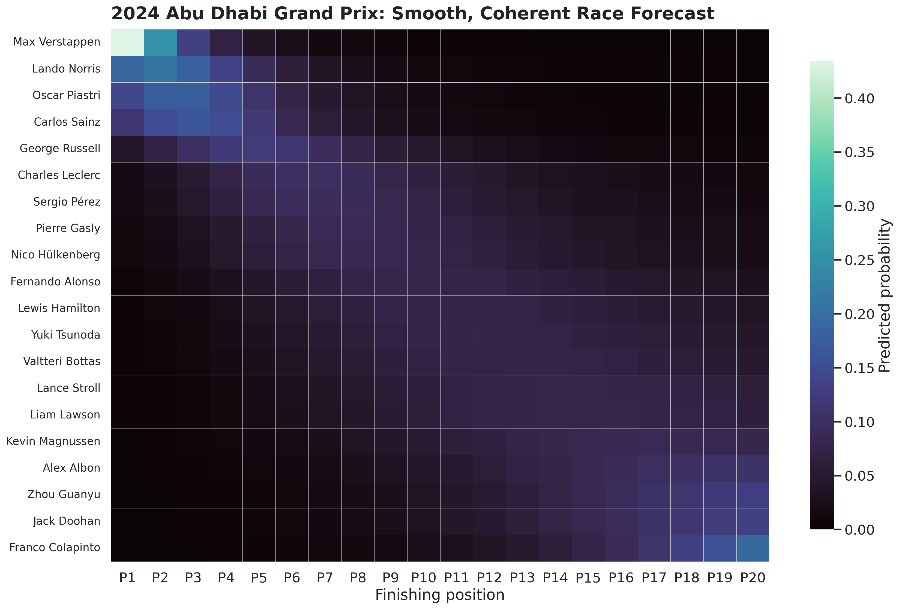

# Formula 1 Race Outcome Forecasting

This project studies Formula 1 race outcomes as probability distributions rather than single finishing-position predictions. It combines historical race, qualifying, driver, constructor, circuit, and reliability data to estimate each driver's probability of finishing in every available position.

The current selected model is a proportional-odds ordinal regression followed by race-level Sinkhorn balancing. The ordinal model produces smooth, ordered driver distributions; the balancing step ensures the full race forecast is coherent—each driver finishes once and each finishing position is occupied once in expectation.

## Project evolution

The project began as a binary classification exercise: will a driver score points? It then expanded through finishing-position regression, strategy and pit-stop analysis, dimensionality diagnostics, resampling, and simulation.

The probabilistic forecasting stage addresses a limitation of point estimates. Predicting that a driver will finish P6 does not distinguish between a tightly concentrated P5–P7 forecast and a highly uncertain P2–P15 forecast. A finishing-position distribution preserves that uncertainty and supports related probabilities such as winning, reaching the podium, or scoring points.

## Data

The raw data comes from the Kaggle Formula 1 World Championship dataset and includes:

- Race results and finishing order
- Qualifying and grid positions
- Drivers and constructors
- Circuits and race metadata
- Driver and constructor standings
- Pit stops, lap times, sprint results, and status codes

The probabilistic feature store contains one row per driver per race:

- 4,626 driver-race observations
- 228 races
- 59 drivers
- Seasons 2014–2024
- Finishing-position support from P1 through P22

Raw and processed data are intentionally excluded from Git.

## Leakage-safe features

All performance features use only information available before the race being predicted. They include:

- Grid and qualifying position
- Driver form over the previous 5 and 10 races
- Constructor form over the previous 5 and 10 races
- Driver and constructor DNF rates
- Prior circuit performance
- Pre-race championship standings
- Prior-season driver and constructor performance
- Field size and season progress

Current-season standings are reset at the start of each season, while prior-season features are stored separately. Rolling features are shifted before calculation to prevent target leakage.

## Validation design

Model development uses expanding-window rolling-origin validation:

| Training seasons | Validation season |
|---|---:|
| 2014–2017 | 2018 |
| 2014–2018 | 2019 |
| 2014–2019 | 2020 |
| 2014–2020 | 2021 |
| 2014–2021 | 2022 |
| 2014–2022 | 2023 |

The 2024 season remained held out until the architecture and selection rule were frozen.

## Modeling progression

### Qualifying baseline

A cumulative ordinal baseline uses grid and qualifying position. It establishes how much predictive information is already contained in starting position.

### Independent cumulative thresholds

The first full model independently estimates `P(finish ≤ k)` for each position threshold. It performs competitively, but 87.7% of 2023 forecasts contain at least one cumulative-threshold crossing before repair. After conversion to position probabilities, every driver distribution is multimodal. Sinkhorn balancing makes the race matrix coherent but cannot remove this driver-level fragmentation.

### Proportional-odds ordinal model

The selected challenger estimates shared feature coefficients with ordered position cutpoints. Its cumulative probabilities cannot cross by construction. Race-level Sinkhorn balancing is then applied to create a coherent driver-by-position matrix.

The architecture was frozen using 2018–2023 only. The selection gate required:

- No more than 2% RPS degradation
- At least 5% log-loss improvement
- No more than 5% multimodal forecasts
- Maximum row and column coherence error of `1e-8`

The proportional-odds model passed with:

- 1.31% RPS degradation
- 10.79% log-loss improvement
- 2.00% expected-position MAE improvement
- Multimodal forecast share reduced from 100% to 0%

## Honest 2024 holdout

All three holdout models were race-balanced before scoring.

| Model | RPS ↓ | Log loss ↓ | Expected MAE ↓ | Points Brier ↓ | Multimodal share |
|---|---:|---:|---:|---:|---:|
| Frozen proportional odds | **0.0953** | 2.5607 | **2.8868** | **0.1232** | **0%** |
| Qualifying baseline | 0.0961 | **2.5389** | 2.9992 | 0.1296 | 85.8% |
| Independent full model | 0.0976 | 2.6271 | 3.1061 | 0.1301 | 100% |

The frozen ordinal model wins on the primary full-distribution metric, expected-position accuracy, and points probability. Qualifying remains marginally stronger for exact-position log loss and particularly informative for winner and podium events.

## Metrics

- **Ranked Probability Score (RPS):** evaluates the entire ordered distribution and penalizes errors according to how far probability lies from the result.
- **Log loss:** penalizes assigning low probability to the exact observed position.
- **Expected-position MAE:** compares the probability-weighted expected finish with the actual finish.
- **Brier scores:** evaluate win, podium, and points probabilities separately.
- **Race coherence:** verifies that driver rows and active finishing-position columns each sum to one.
- **Shape diagnostics:** measure threshold crossings, local peaks, multimodality, entropy, and effective distribution width.

## Article figures

Final publication figures are stored in `outputs/article_probabilistic_forecasting/final/`:

1. Model-selection trade-off
2. Frozen 2024 holdout comparison
3. Smooth coherent Abu Dhabi heatmap
4. Favorite, midfield, and long-shot distributions
5. Win, podium, and points probabilities
6. Expected finish and central 80% interval



## Reproducing the analysis

Create and activate a Python 3.12 virtual environment:

```bash
python3.12 -m venv .venv
source .venv/bin/activate
python -m pip install --upgrade pip setuptools wheel
python -m pip install -r requirements.txt
```

Install the Jupyter kernel if desired:

```bash
python -m ipykernel install \
  --user \
  --name f1-worldchamp \
  --display-name "Python 3.12 (f1-worldchamp)"
```

Place the Kaggle CSV files in `data_raw/`, then run the probabilistic workflow:

```bash
python src/build_probabilistic_dataset.py
python 08_validate_race_balancing.py
python 09_diagnose_distribution_shapes.py
python 09_compare_ordinal_models.py
python 10_freeze_selected_structure.py
python 10_finalize_article_suite.py
python 11_polish_article_visualizations.py
```

The proportional-odds fits can take several minutes. A Hessian inversion warning means coefficient standard errors are unavailable because the engineered features are highly correlated; the project uses the estimator for prediction, not coefficient-level inference.

For a guided analysis, open `08_probabilistic_race_forecasting.ipynb` and select the `Python 3.12 (f1-worldchamp)` kernel.

## Repository structure

```text
data_raw/                                  # Ignored Kaggle source files
data_processed/                            # Ignored feature stores and predictions
outputs/article_probabilistic_forecasting/ # Frozen metrics and final figures
outputs/figures_09/                        # Ordinal validation and frozen specification
src/build_probabilistic_dataset.py         # Leakage-safe feature-store builder
src/probabilistic_model.py                 # Models, scoring, balancing, diagnostics
08_probabilistic_race_forecasting.ipynb    # Reproducible narrative analysis
08_validate_race_balancing.py              # Coherence validation
09_compare_ordinal_models.py                # Rolling-origin model comparison
10_freeze_selected_structure.py            # Pre-holdout model freeze
10_finalize_article_suite.py                # Holdout evaluation and figures
11_polish_article_visualizations.py         # Publication formatting
```

## Limitations

- DNFs are currently represented through finishing order rather than modeled as a separate race process.
- Regulation eras and temporal drift are not yet explicitly modeled.
- Correlated predictors prevent reliable coefficient standard errors in the proportional-odds fit.
- The current race matrix is coherent in expectation but is not yet a full generative race simulation.
- Weather, tire compounds, live timing, penalties, and race disruptions are not yet available consistently at forecast time.

## Next steps

1. Model DNF and race-disruption risk separately from running-order performance.
2. Add era-aware and recency-weighted training.
3. Compare proportional odds with a race-ranking or Plackett–Luce model.
4. Add weather, circuit, tire, and penalty information where it is available pre-race.
5. Build a live 2026 race-by-race forecasting pipeline.
6. Convert coherent distributions into simulated race scenarios and championship probabilities.

